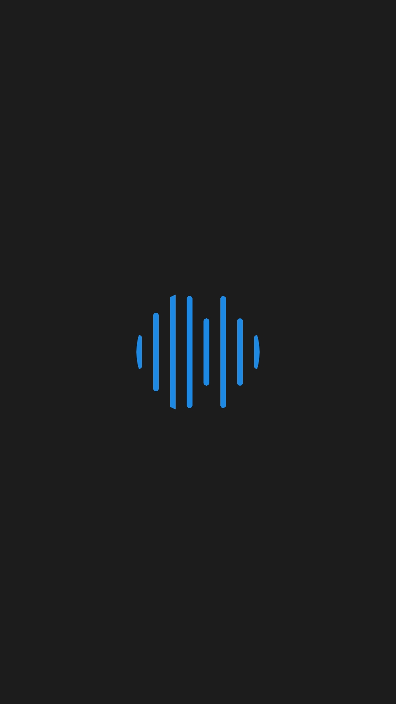
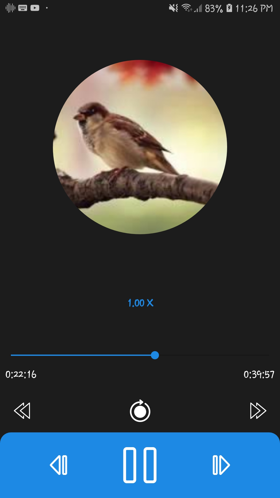
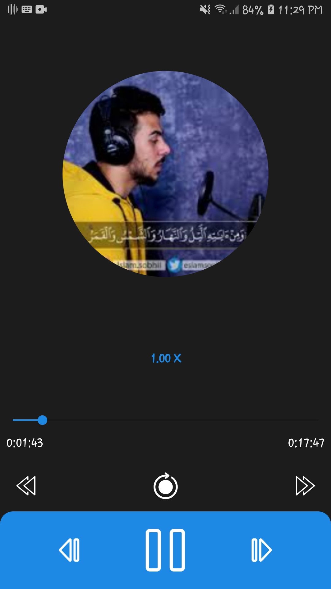
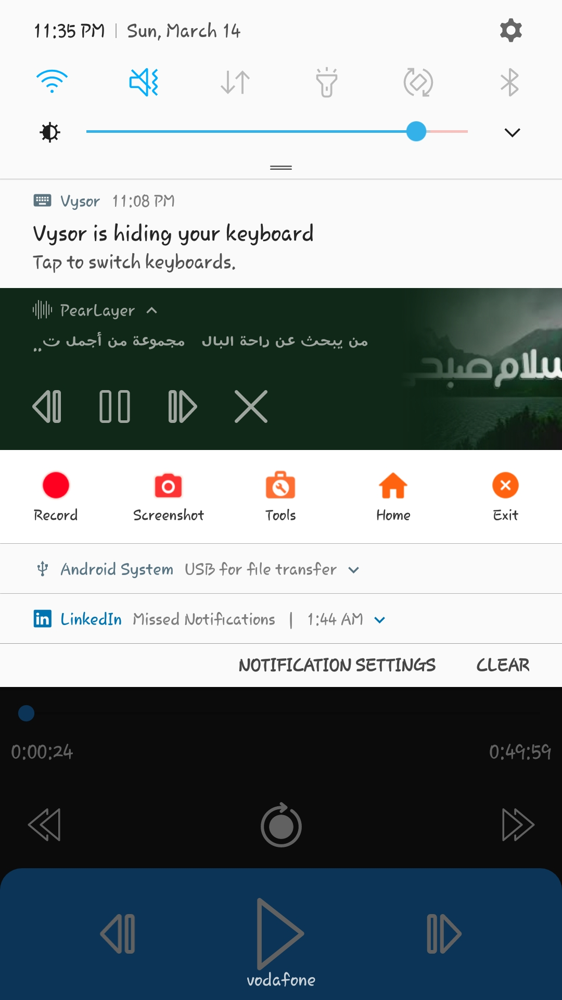

# PearLayer

This repository is for my new app called PearLayer which allows users to play audio of different extensions.

# Built with:

Java
---
MVC
---
Services (Foreground & Bound)
---
BroadcastRecevier
---
ContentResolver
---
MediaPlayer class
---

# Screen shots: 
---

 

 

 

 

 

 

