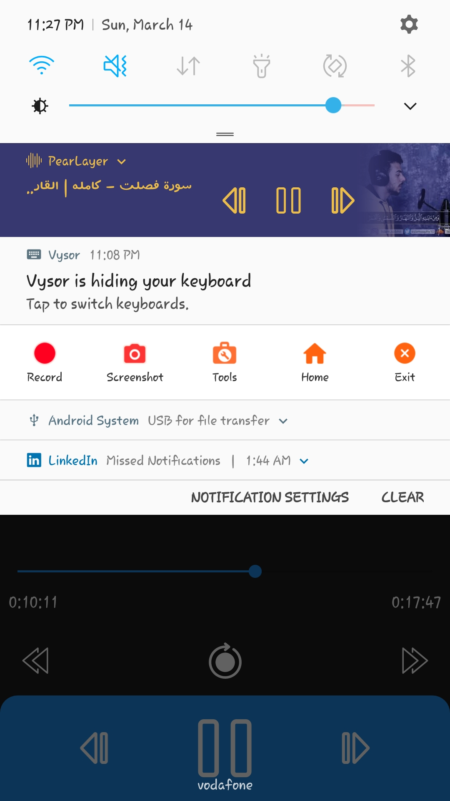

# PearLayer

This repository is for my new app called PearLayer which allows users to play audio of different extensions.

# Built with:

Java
---
MVC
---
Services ( Foreground & Bound )
---
BroadcastRecevier
---
ContentProvider
---
MediaPlayer class
---

# Screen shots: 
---
# Features: 
Load device audios and play them.  
Control playing audio via either activity or notification.  
Ability to work in background.  
Handling incoming calls, and when sound focus is lost.  
Ability to speed, and slow the audio, repeat, and not repeat it.  

 

 

 

 

 

